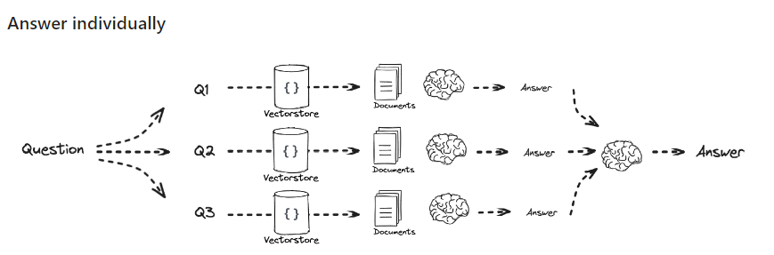
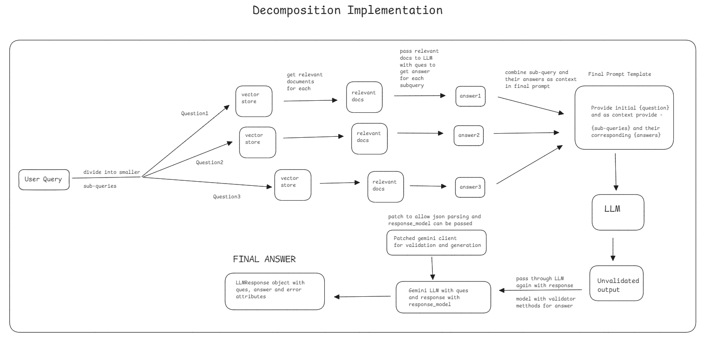

- This repo explains how to implement **Query Decomposition** while creating RAG applications using Langchain with Gemini. 
- We also go a step ahead and use **pydantic** and **instructor** to create **structured LLM outputs**
- `llm_validator` is implemented to validate LLM outputs based on custom queries and error handling done so responses are validated before sending them to the user.
- The repo makes sure code is in proper format and final outputs are ready to be passed as responses to other applicatons/microservices.

***

### Query Decomposition Approach in RAG

It works by breaking a complex query into smaller and simpler sub-queries. Each sub-query focuses on a specific aspect of the original question.

Once the query is decomposed, the system can retrieve relevant documents or information for each sub-query either sequentially or in parallel.

#### Steps

- Input user query and create gemini llm, embedding function and vectorDB
- query the LLM to create `n` sub-queries from given query. Here `n` was 3
- Create RAG chain which **gets answer for each sub-query and uses it as context to answer the initial question**
- Create gemini client(similar to llm) and **patch with instructor** to use `response_model`
- Create a class to store response named `LLMResponse` which has attribute `answer` of type hint `KubernetesAnswer` that has pydantic validation and `llm_validator` to validate text with custom prompt.
- For the errorMessage attribute of above class, call function `generateError` which takes ValidationError as string input and provides error
- Create try/except block where `finalResponse` is stored and it can be checked if it contains error via it's fields and can be used to send results to other services

***

### Query Decomposition Workflow

